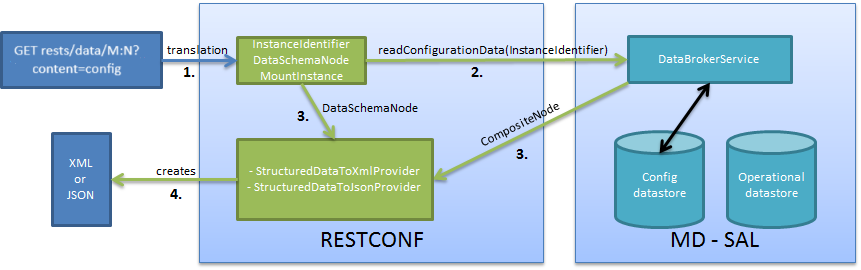
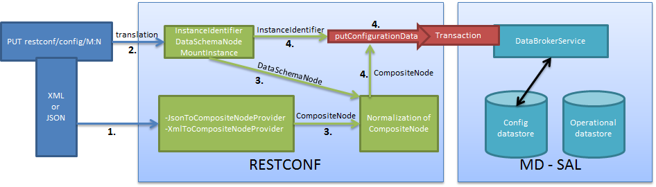
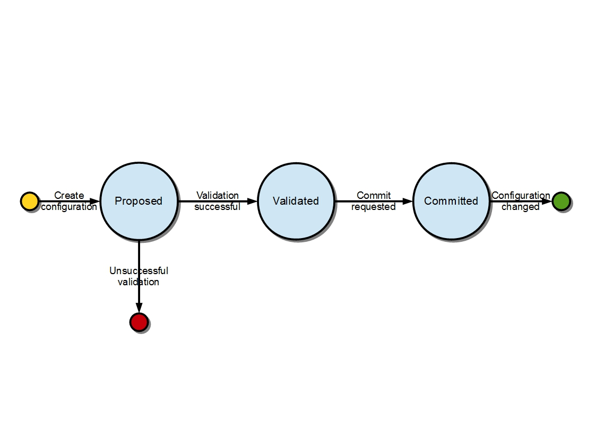
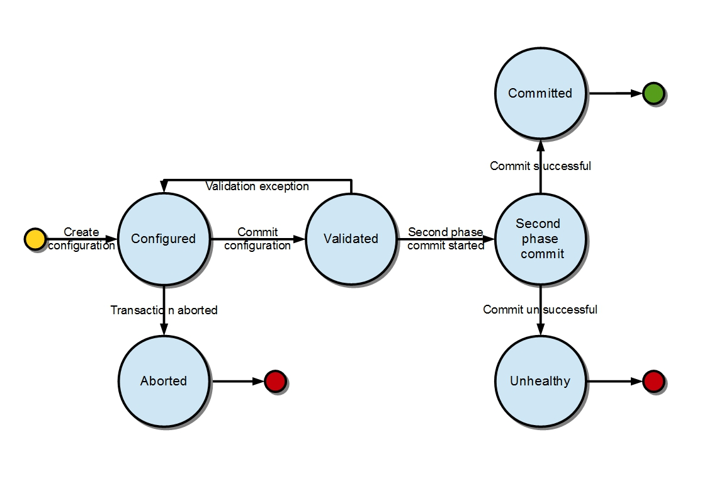

.. _controller-dev-guide:

Controller
==========

Overview
--------

OpenDaylight Controller is Java-based, model-driven controller using
YANG as its modeling language for various aspects of the system and
applications and with its components serves as a base platform for other
OpenDaylight applications.

The OpenDaylight Controller relies on the following technologies:

-  **OSGI** - This framework is the back-end of OpenDaylight as it
   allows dynamically loading of bundles and packages JAR files, and
   binding bundles together for exchanging information.

-  **Karaf** - Application container built on top of OSGI, which
   simplifies operational aspects of packaging and installing
   applications.

-  **YANG** - a data modeling language used to model configuration and
   state data manipulated by the applications, remote procedure calls,
   and notifications.

The OpenDaylight Controller provides following model-driven subsystems
as a foundation for Java applications:

-  :ref:`config_subsystem` - an activation,
   dependency-injection and configuration framework, which allows
   two-phase commits of configuration and dependency-injection, and
   allows for run-time rewiring.

-  :ref:`MD-SAL <mdsal_dev_guide>` - messaging and data storage
   functionality for data, notifications and RPCs modeled by application
   developers. MD-SAL uses YANG as the modeling for both interface and
   data definitions, and provides a messaging and data-centric runtime
   for such services based on YANG modeling.

-  **MD-SAL Clustering** - enables cluster support for core MD-SAL
   functionality and provides location-transparent accesss to
   YANG-modeled data.

The OpenDaylight Controller supports external access to applications and
data using following model-driven protocols:

-  **NETCONF** - XML-based RPC protocol, which provides abilities for
   client to invoke YANG-modeled RPCs, receive notifications and to
   read, modify and manipulate YANG modeled data.

-  **RESTCONF** - HTTP-based protocol, which provides REST-like APIs to
   manipulate YANG modeled data and invoke YANG modeled RPCs, using XML
   or JSON as payload format.

.. _mdsal_dev_guide:

MD-SAL Overview
---------------

The Model-Driven Service Adaptation Layer (MD-SAL) is message-bus
inspired extensible middleware component that provides messaging and
data storage functionality based on data and interface models defined by
application developers (i.e. user-defined models).

The MD-SAL:

-  Defines a **common-layer, concepts, data model building blocks and
   messaging patterns** and provides infrastructure / framework for
   applications and inter-application communication.

-  Provide common support for user-defined transport and payload
   formats, including payload serialization and adaptation (e.g. binary,
   XML or JSON).

The MD-SAL uses **YANG** as the modeling language for both interface and
data definitions, and provides a messaging and data-centric runtime for
such services based on YANG modeling.

| The MD-SAL provides two different API types (flavours):

-  **MD-SAL Binding:** MD-SAL APIs which extensively uses APIs and
   classes generated from YANG models, which provides compile-time
   safety.

-  **MD-SAL DOM:** (Document Object Model) APIs which uses DOM-like
   representation of data, which makes them more powerful, but provides
   less compile-time safety.

.. note::

    Model-driven nature of the MD-SAL and **DOM**-based APIs allows for
    behind-the-scene API and payload type mediation and transformation
    to facilitate seamless communication between applications - this
    enables for other components and applications to provide connectors
    / expose different set of APIs and derive most of its functionality
    purely from models, which all existing code can benefit from without
    modification. For example **RESTCONF Connector** is an application
    built on top of MD-SAL and exposes YANG-modeled application APIs
    transparently via HTTP and adds support for XML and JSON payload
    type.

Basic concepts
~~~~~~~~~~~~~~

Basic concepts are building blocks which are used by applications, and
from which MD-SAL uses to define messaging patterns and to provide
services and behavior based on developer-supplied YANG models.

Data Tree
    All state-related data are modeled and represented as data tree,
    with possibility to address any element / subtree

    -  **Operational Data Tree** - Reported state of the system,
       published by the providers using MD-SAL. Represents a feedback
       loop for applications to observe state of the network / system.

    -  **Configuration Data Tree** - Intended state of the system or
       network, populated by consumers, which expresses their intention.

Instance Identifier
    Unique identifier of node / subtree in data tree, which provides
    unambiguous information, how to reference and retrieve node /
    subtree from conceptual data trees.

Notification
    Asynchronous transient event which may be consumed by subscribers
    and they may act upon it

RPC
    asynchronous request-reply message pair, when request is triggered
    by consumer, send to the provider, which in future replies with
    reply message.

    .. note::

        In MD-SAL terminology, the term *RPC* is used to define the
        input and output for a procedure (function) that is to be
        provided by a provider, and mediated by the MD-SAL, that means
        it may not result in remote call.

Messaging Patterns
~~~~~~~~~~~~~~~~~~

MD-SAL provides several messaging patterns using broker derived from
basic concepts, which are intended to transfer YANG modeled data between
applications to provide data-centric integration between applications
instead of API-centric integration.

-  **Unicast communication**

   -  **Remote Procedure Calls** - unicast between consumer and
      provider, where consumer sends **request** message to provider,
      which asynchronously responds with **reply** message

-  **Publish / Subscribe**

   -  **Notifications** - multicast transient message which is published
      by provider and is delivered to subscribers

   -  **Data Change Events** - multicast asynchronous event, which is
      sent by data broker if there is change in conceptual data tree,
      and is delivered to subscribers

-  **Transactional access to Data Tree**

   -  Transactional **reads** from conceptual **data tree** - read-only
      transactions with isolation from other running transactions.

   -  Transactional **modification** to conceptual **data tree** - write
      transactions with isolation from other running transactions.

   -  **Transaction chaining**

MD-SAL Data Transactions
------------------------

MD-SAL **Data Broker** provides transactional access to conceptual
**data trees** representing configuration and operational state.

.. note::

    **Data tree** usually represents state of the modeled data, usually
    this is state of controller, applications and also external systems
    (network devices).

**Transactions** provide :ref:`stable and isolated
view <transaction_isolation>` from other currently running
transactions. The state of running transaction and underlying data tree
is not affected by other concurrently running transactions.

Write-Only
    Transaction provides only modification capabilities, but does not
    provide read capabilities. Write-only transaction is allocated using
    ``newWriteOnlyTransaction()``.

    .. note::

        This allows less state tracking for write-only transactions and
        allows MD-SAL Clustering to optimize internal representation of
        transaction in cluster.

Read-Write
    Transaction provides both read and write capabilities. It is
    allocated using ``newReadWriteTransaction()``.

Read-Only
    Transaction provides stable read-only view based on current data
    tree. Read-only view is not affected by any subsequent write
    transactions. Read-only transaction is allocated using
    ``newReadOnlyTransaction()``.

    .. note::

        If an application needs to observe changes itself in data tree,
        it should use **data tree listeners** instead of read-only
        transactions and polling data tree.

Transactions may be allocated using the **data broker** itself or using
**transaction chain**. In the case of **transaction chain**, the new
allocated transaction is not based on current state of data tree, but
rather on state introduced by previous transaction from the same chain,
even if the commit for previous transaction has not yet occurred (but
transaction was submitted).

Write-Only & Read-Write Transaction
~~~~~~~~~~~~~~~~~~~~~~~~~~~~~~~~~~~

Write-Only and Read-Write transactions provide modification capabilities
for the conceptual data trees.

1. application allocates new transactions using
   ``newWriteOnlyTransaction()`` or ``newReadWriteTransaction()``.

2. application `modifies data tree <#_modification_of_data_tree>`__
   using ``put``, ``merge`` and/or ``delete``.

3. application finishes transaction using
   ``submit()``, which :ref:`seals transaction
   and submits <submitting_transaction>` it to be processed.

4. application observes the result of the transaction commit using
   either blocking or asynchronous calls.

The **initial state** of the write transaction is a **stable snapshot**
of the current data tree state captured when transaction was created and
it’s state and underlying data tree are not affected by other
concurrently running transactions.

Write transactions are **isolated** from other concurrent write
transactions. All :ref:`writes are local <transaction_local_state>`
to the transaction and represents only a **proposal of state change**
for data tree and **are not visible** to any other concurrently running
transactions (including read-only transactions).

The transaction :ref:`commit may fail <commit_failure_scenarios>` due
to failing verification of data or concurrent transaction modifying and
affected data in an incompatible way.

Modification of Data Tree
^^^^^^^^^^^^^^^^^^^^^^^^^

Write-only and read-write transaction provides following methods to
modify data tree:

put
    .. code:: java

        <T> void put(LogicalDatastoreType store, InstanceIdentifier<T> path, T data);

    Stores a piece of data at a specified path. This acts as an **add /
    replace** operation, which is to say that whole subtree will be
    replaced by the specified data.

merge
    .. code:: java

        <T> void merge(LogicalDatastoreType store, InstanceIdentifier<T> path, T data);

    Merges a piece of data with the existing data at a specified path.
    Any **pre-existing data** which are not explicitly overwritten
    **will be preserved**. This means that if you store a container, its
    child subtrees will be merged.

delete
    .. code:: java

        void delete(LogicalDatastoreType store, InstanceIdentifier<?> path);

    Removes a whole subtree from a specified path.

.. _submitting_transaction:

Submitting transaction
^^^^^^^^^^^^^^^^^^^^^^

Transaction is submitted to be processed and committed using following
method:

.. code:: java

    CheckedFuture<Void,TransactionCommitFailedException> submit();

Applications publish the changes proposed in the transaction by calling
``submit()`` on the transaction. This **seals the transaction**
(preventing any further writes using this transaction) and submits it to
be processed and applied to global conceptual data tree. The
``submit()`` method does not block, but rather returns
``ListenableFuture``, which will complete successfully once processing
of transaction is finished and changes are applied to data tree. If
**commit** of data failed, the future will fail with
``TransactionFailedException``.

Application may listen on commit state asynchronously using
``ListenableFuture``.

.. code:: java

    Futures.addCallback( writeTx.submit(), new FutureCallback<Void>() {
            public void onSuccess( Void result ) {
                LOG.debug("Transaction committed successfully.");
            }

            public void onFailure( Throwable t ) {
                LOG.error("Commit failed.",e);
            }
        });

-  Submits ``writeTx`` and registers application provided
   ``FutureCallback`` on returned future.

-  Invoked when future completed successfully - transaction ``writeTx``
   was successfully committed to data tree.

-  Invoked when future failed - commit of transaction ``writeTx``
   failed. Supplied exception provides additional details and cause of
   failure.

If application need to block till commit is finished it may use
``checkedGet()`` to wait till commit is finished.

.. code:: java

    try {
        writeTx.submit().checkedGet();
    } catch (TransactionCommitFailedException e) {
        LOG.error("Commit failed.",e);
    }

-  Submits ``writeTx`` and blocks till commit of ``writeTx`` is
   finished. If commit fails ``TransactionCommitFailedException`` will
   be thrown.

-  Catches ``TransactionCommitFailedException`` and logs it.

.. _transaction_local_state:

Transaction local state
^^^^^^^^^^^^^^^^^^^^^^^

Read-Write transactions maintain transaction-local state, which renders
all modifications as if they happened, but this is only local to
transaction.

Reads from the transaction returns data as if the previous modifications
in transaction already happened.

Let assume initial state of data tree for ``PATH`` is ``A``.

.. code:: java

    ReadWriteTransaction rwTx = broker.newReadWriteTransaction();

    rwRx.read(OPERATIONAL,PATH).get();
    rwRx.put(OPERATIONAL,PATH,B);
    rwRx.read(OPERATIONAL,PATH).get();
    rwRx.put(OPERATIONAL,PATH,C);
    rwRx.read(OPERATIONAL,PATH).get();

-  Allocates new ``ReadWriteTransaction``.

-  Read from ``rwTx`` will return value ``A`` for ``PATH``.

-  Writes value ``B`` to ``PATH`` using ``rwTx``.

-  Read will return value ``B`` for ``PATH``, since previous write
   occurred in same transaction.

-  Writes value ``C`` to ``PATH`` using ``rwTx``.

-  Read will return value ``C`` for ``PATH``, since previous write
   occurred in same transaction.

.. _transaction_isolation:

Transaction isolation
~~~~~~~~~~~~~~~~~~~~~

Running (not submitted) transactions are isolated from each other and
changes done in one transaction are not observable in other currently
running transaction.

Lets assume initial state of data tree for ``PATH`` is ``A``.

.. code:: java

    ReadOnlyTransaction txRead = broker.newReadOnlyTransaction();
    ReadWriteTransaction txWrite = broker.newReadWriteTransaction();

    txRead.read(OPERATIONAL,PATH).get();
    txWrite.put(OPERATIONAL,PATH,B);
    txWrite.read(OPERATIONAL,PATH).get();
    txWrite.submit().get();
    txRead.read(OPERATIONAL,PATH).get();
    txAfterCommit = broker.newReadOnlyTransaction();
    txAfterCommit.read(OPERATIONAL,PATH).get();

-  Allocates read only transaction, which is based on data tree which
   contains value ``A`` for ``PATH``.

-  Allocates read write transaction, which is based on data tree which
   contains value ``A`` for ``PATH``.

-  Read from read-only transaction returns value ``A`` for ``PATH``.

-  Data tree is updated using read-write transaction, ``PATH`` contains
   ``B``. Change is not public and only local to transaction.

-  Read from read-write transaction returns value ``B`` for ``PATH``.

-  Submits changes in read-write transaction to be committed to data
   tree. Once commit will finish, changes will be published and ``PATH``
   will be updated for value ``B``. Previously allocated transactions
   are not affected by this change.

-  Read from previously allocated read-only transaction still returns
   value ``A`` for ``PATH``, since it provides stable and isolated view.

-  Allocates new read-only transaction, which is based on data tree,
   which contains value ``B`` for ``PATH``.

-  Read from new read-only transaction return value ``B`` for ``PATH``
   since read-write transaction was committed.

.. note::

    Examples contain blocking calls on future only to illustrate that
    action happened after other asynchronous action. The use of the
    blocking call ``ListenableFuture#get()`` is discouraged for most
    use-cases and you should use
    ``Futures#addCallback(ListenableFuture, FutureCallback)`` to listen
    asynchronously for result.

.. _commit_failure_scenarios:

Commit failure scenarios
~~~~~~~~~~~~~~~~~~~~~~~~

A transaction commit may fail because of following reasons:

Optimistic Lock Failure
    Another transaction finished earlier and **modified the same node in
    a non-compatible way**. The commit (and the returned future) will
    fail with an ``OptimisticLockFailedException``.

    It is the responsibility of the caller to create a new transaction
    and submit the same modification again in order to update data tree.

    .. warning::

        ``OptimisticLockFailedException`` usually exposes **multiple
        writers** to the same data subtree, which may conflict on same
        resources.

        In most cases, retrying may result in a probability of success.

        There are scenarios, albeit unusual, where any number of retries
        will not succeed. Therefore it is strongly recommended to limit
        the number of retries (2 or 3) to avoid an endless loop.

Data Validation
    The data change introduced by this transaction **did not pass
    validation** by commit handlers or data was incorrectly structured.
    The returned future will fail with a
    ``DataValidationFailedException``. User **should not retry** to
    create new transaction with same data, since it probably will fail
    again.

Example conflict of two transactions
^^^^^^^^^^^^^^^^^^^^^^^^^^^^^^^^^^^^

This example illustrates two concurrent transactions, which derived from
same initial state of data tree and proposes conflicting modifications.

.. code:: java

    WriteTransaction txA = broker.newWriteTransaction();
    WriteTransaction txB = broker.newWriteTransaction();

    txA.put(CONFIGURATION, PATH, A);
    txB.put(CONFIGURATION, PATH, B);

    CheckedFuture<?,?> futureA = txA.submit();
    CheckedFuture<?,?> futureB = txB.submit();

-  Updates ``PATH`` to value ``A`` using ``txA``

-  Updates ``PATH`` to value ``B`` using ``txB``

-  Seals & submits ``txA``. The commit will be processed asynchronously
   and data tree will be updated to contain value ``A`` for ``PATH``.
   The returned ‘ListenableFuture’ will complete successfully once state
   is applied to data tree.

-  Seals & submits ``txB``. Commit of ``txB`` will fail, because
   previous transaction also modified path in a concurrent way. The
   state introduced by ``txB`` will not be applied. The returned
   ``ListenableFuture`` will fail with ``OptimisticLockFailedException``
   exception, which indicates that concurrent transaction prevented the
   submitted transaction from being applied.

Example asynchronous retry-loop
^^^^^^^^^^^^^^^^^^^^^^^^^^^^^^^

.. code:: java

    private void doWrite( final int tries ) {
        WriteTransaction writeTx = dataBroker.newWriteOnlyTransaction();

        MyDataObject data = ...;
        InstanceIdentifier<MyDataObject> path = ...;
        writeTx.put( LogicalDatastoreType.OPERATIONAL, path, data );

        Futures.addCallback( writeTx.submit(), new FutureCallback<Void>() {
            public void onSuccess( Void result ) {
                // succeeded
            }

            public void onFailure( Throwable t ) {
                if( t instanceof OptimisticLockFailedException && (( tries - 1 ) > 0)) {
                    doWrite( tries - 1 );
                }
            }
          });
    }
    ...
    doWrite( 2 );

Concurrent change compatibility
~~~~~~~~~~~~~~~~~~~~~~~~~~~~~~~

There are several sets of changes which could be considered incompatible
between two transactions which are derived from same initial state.
Rules for conflict detection applies recursively for each subtree level.

Following table shows state changes and failures between two concurrent
transactions, which are based on same initial state, ``tx1`` is
submitted before ``tx2``.

INFO: Following tables stores numeric values and shows data using
``toString()`` to simplify examples.

+--------------------+--------------------+--------------------+--------------------+
| Initial state      | tx1                | tx2                | Observable Result  |
+====================+====================+====================+====================+
| Empty              | ``put(A,1)``       | ``put(A,2)``       | ``tx2`` will fail, |
|                    |                    |                    | value of ``A`` is  |
|                    |                    |                    | ``1``              |
+--------------------+--------------------+--------------------+--------------------+
| Empty              | ``put(A,1)``       | ``merge(A,2)``     | value of ``A`` is  |
|                    |                    |                    | ``2``              |
+--------------------+--------------------+--------------------+--------------------+
| Empty              | ``merge(A,1)``     | ``put(A,2)``       | ``tx2`` will fail, |
|                    |                    |                    | value of ``A`` is  |
|                    |                    |                    | ``1``              |
+--------------------+--------------------+--------------------+--------------------+
| Empty              | ``merge(A,1)``     | ``merge(A,2)``     | ``A`` is ``2``     |
+--------------------+--------------------+--------------------+--------------------+
| A=0                | ``put(A,1)``       | ``put(A,2)``       | ``tx2`` will fail, |
|                    |                    |                    | ``A`` is ``1``     |
+--------------------+--------------------+--------------------+--------------------+
| A=0                | ``put(A,1)``       | ``merge(A,2)``     | ``A`` is ``2``     |
+--------------------+--------------------+--------------------+--------------------+
| A=0                | ``merge(A,1)``     | ``put(A,2)``       | ``tx2`` will fail, |
|                    |                    |                    | value of ``A`` is  |
|                    |                    |                    | ``1``              |
+--------------------+--------------------+--------------------+--------------------+
| A=0                | ``merge(A,1)``     | ``merge(A,2)``     | ``A`` is ``2``     |
+--------------------+--------------------+--------------------+--------------------+
| A=0                | ``delete(A)``      | ``put(A,2)``       | ``tx2`` will fail, |
|                    |                    |                    | ``A`` does not     |
|                    |                    |                    | exists             |
+--------------------+--------------------+--------------------+--------------------+
| A=0                | ``delete(A)``      | ``merge(A,2)``     | ``A`` is ``2``     |
+--------------------+--------------------+--------------------+--------------------+

Table: Concurrent change resolution for leaves and leaf-list items

+--------------------+--------------------+--------------------+--------------------+
| Initial state      | ``tx1``            | ``tx2``            | Result             |
+====================+====================+====================+====================+
| Empty              | put(TOP,[])        | put(TOP,[])        | ``tx2`` will fail, |
|                    |                    |                    | state is TOP=[]    |
+--------------------+--------------------+--------------------+--------------------+
| Empty              | put(TOP,[])        | merge(TOP,[])      | TOP=[]             |
+--------------------+--------------------+--------------------+--------------------+
| Empty              | put(TOP,[FOO=1])   | put(TOP,[BAR=1])   | ``tx2`` will fail, |
|                    |                    |                    | state is           |
|                    |                    |                    | TOP=[FOO=1]        |
+--------------------+--------------------+--------------------+--------------------+
| Empty              | put(TOP,[FOO=1])   | merge(TOP,[BAR=1]) | TOP=[FOO=1,BAR=1]  |
+--------------------+--------------------+--------------------+--------------------+
| Empty              | merge(TOP,[FOO=1]) | put(TOP,[BAR=1])   | ``tx2`` will fail, |
|                    |                    |                    | state is           |
|                    |                    |                    | TOP=[FOO=1]        |
+--------------------+--------------------+--------------------+--------------------+
| Empty              | merge(TOP,[FOO=1]) | merge(TOP,[BAR=1]) | TOP=[FOO=1,BAR=1]  |
+--------------------+--------------------+--------------------+--------------------+
| TOP=[]             | put(TOP,[FOO=1])   | put(TOP,[BAR=1])   | ``tx2`` will fail, |
|                    |                    |                    | state is           |
|                    |                    |                    | TOP=[FOO=1]        |
+--------------------+--------------------+--------------------+--------------------+
| TOP=[]             | put(TOP,[FOO=1])   | merge(TOP,[BAR=1]) | state is           |
|                    |                    |                    | TOP=[FOO=1,BAR=1]  |
+--------------------+--------------------+--------------------+--------------------+
| TOP=[]             | merge(TOP,[FOO=1]) | put(TOP,[BAR=1])   | ``tx2`` will fail, |
|                    |                    |                    | state is           |
|                    |                    |                    | TOP=[FOO=1]        |
+--------------------+--------------------+--------------------+--------------------+
| TOP=[]             | merge(TOP,[FOO=1]) | merge(TOP,[BAR=1]) | state is           |
|                    |                    |                    | TOP=[FOO=1,BAR=1]  |
+--------------------+--------------------+--------------------+--------------------+
| TOP=[]             | delete(TOP)        | put(TOP,[BAR=1])   | ``tx2`` will fail, |
|                    |                    |                    | state is empty     |
|                    |                    |                    | store              |
+--------------------+--------------------+--------------------+--------------------+
| TOP=[]             | delete(TOP)        | merge(TOP,[BAR=1]) | state is           |
|                    |                    |                    | TOP=[BAR=1]        |
+--------------------+--------------------+--------------------+--------------------+
| TOP=[]             | put(TOP/FOO,1)     | put(TOP/BAR,1])    | state is           |
|                    |                    |                    | TOP=[FOO=1,BAR=1]  |
+--------------------+--------------------+--------------------+--------------------+
| TOP=[]             | put(TOP/FOO,1)     | merge(TOP/BAR,1)   | state is           |
|                    |                    |                    | TOP=[FOO=1,BAR=1]  |
+--------------------+--------------------+--------------------+--------------------+
| TOP=[]             | merge(TOP/FOO,1)   | put(TOP/BAR,1)     | state is           |
|                    |                    |                    | TOP=[FOO=1,BAR=1]  |
+--------------------+--------------------+--------------------+--------------------+
| TOP=[]             | merge(TOP/FOO,1)   | merge(TOP/BAR,1)   | state is           |
|                    |                    |                    | TOP=[FOO=1,BAR=1]  |
+--------------------+--------------------+--------------------+--------------------+
| TOP=[]             | delete(TOP)        | put(TOP/BAR,1)     | ``tx2`` will fail, |
|                    |                    |                    | state is empty     |
|                    |                    |                    | store              |
+--------------------+--------------------+--------------------+--------------------+
| TOP=[]             | delete(TOP)        | merge(TOP/BAR,1]   | ``tx2`` will fail, |
|                    |                    |                    | state is empty     |
|                    |                    |                    | store              |
+--------------------+--------------------+--------------------+--------------------+
| TOP=[FOO=1]        | put(TOP/FOO,2)     | put(TOP/BAR,1)     | state is           |
|                    |                    |                    | TOP=[FOO=2,BAR=1]  |
+--------------------+--------------------+--------------------+--------------------+
| TOP=[FOO=1]        | put(TOP/FOO,2)     | merge(TOP/BAR,1)   | state is           |
|                    |                    |                    | TOP=[FOO=2,BAR=1]  |
+--------------------+--------------------+--------------------+--------------------+
| TOP=[FOO=1]        | merge(TOP/FOO,2)   | put(TOP/BAR,1)     | state is           |
|                    |                    |                    | TOP=[FOO=2,BAR=1]  |
+--------------------+--------------------+--------------------+--------------------+
| TOP=[FOO=1]        | merge(TOP/FOO,2)   | merge(TOP/BAR,1)   | state is           |
|                    |                    |                    | TOP=[FOO=2,BAR=1]  |
+--------------------+--------------------+--------------------+--------------------+
| TOP=[FOO=1]        | delete(TOP/FOO)    | put(TOP/BAR,1)     | state is           |
|                    |                    |                    | TOP=[BAR=1]        |
+--------------------+--------------------+--------------------+--------------------+
| TOP=[FOO=1]        | delete(TOP/FOO)    | merge(TOP/BAR,1]   | state is           |
|                    |                    |                    | TOP=[BAR=1]        |
+--------------------+--------------------+--------------------+--------------------+

Table: Concurrent change resolution for containers, lists, list items

MD-SAL RPC routing
------------------

The MD-SAL provides a way to deliver Remote Procedure Calls (RPCs) to a
particular implementation based on content in the input as it is modeled
in YANG. This part of the RPC input is referred to as a **context
reference**.

The MD-SAL does not dictate the name of the leaf which is used for this
RPC routing, but provides necessary functionality for YANG model author
to define their **context reference** in their model of RPCs.

MD-SAL routing behavior is modeled using following terminology and its
application to YANG models:

Context Type
    Logical type of RPC routing. Context type is modeled as YANG
    ``identity`` and is referenced in model to provide scoping
    information.

Context Instance
    Conceptual location in data tree, which represents context in which
    RPC could be executed. Context instance usually represent logical
    point to which RPC execution is attached.

Context Reference
    Field of RPC input payload which contains Instance Identifier
    referencing **context instance** in which the RPC should be
    executed.

Modeling a routed RPC
~~~~~~~~~~~~~~~~~~~~~

In order to define routed RPCs, the YANG model author needs to declare
(or reuse) a **context type**, set of possible **context instances** and
finally RPCs which will contain **context reference** on which they will
be routed.

Declaring a routing context type
^^^^^^^^^^^^^^^^^^^^^^^^^^^^^^^^

.. code::

    identity node-context {
        description "Identity used to mark node context";
    }

This declares an identity named ``node-context``, which is used as
marker for node-based routing and is used in other places to reference
that routing type.

Declaring possible context instances
^^^^^^^^^^^^^^^^^^^^^^^^^^^^^^^^^^^^

In order to define possible values of **context instances** for routed
RPCs, we need to model that set accordingly using ``context-instance``
extension from the ``yang-ext`` model.

.. code::

    import yang-ext { prefix ext; }

    /** Base structure **/
    container nodes {
        list node {
            key "id";
            ext:context-instance "node-context";
            // other node-related fields would go here
        }
    }

The statement ``ext:context-instance "node-context";`` marks any element
of the ``list node`` as a possible valid **context instance** in
``node-context`` based routing.

.. note::

    The existence of a **context instance** node in operational or
    config data tree is not strongly tied to existence of RPC
    implementation.

    For most routed RPC models, there is relationship between the data
    present in operational data tree and RPC implementation
    availability, but this is not enforced by MD-SAL. This provides some
    flexibility for YANG model writers to better specify their routing
    model and requirements for implementations. Details when RPC
    implementations are available should be documented in YANG model.

    If user invokes RPC with a **context instance** that has no
    registered implementation, the RPC invocation will fail with the
    exception ``DOMRpcImplementationNotAvailableException``.

Declaring a routed RPC
^^^^^^^^^^^^^^^^^^^^^^

To declare RPC to be routed based on ``node-context`` we need to add
leaf of ``instance-identifier`` type (or type derived from
``instance-identifier``) to the RPC and mark it as **context
reference**.

This is achieved using YANG extension ``context-reference`` from
``yang-ext`` model on leaf, which will be used for RPC routing.

.. code::

    rpc example-routed-rpc  {
        input {
            leaf node {
                ext:context-reference "node-context";
                type "instance-identifier";
            }
            // other input to the RPC would go here
        }
    }

The statement ``ext:context-reference "node-context"`` marks
``leaf node`` as **context reference** of type ``node-context``. The
value of this leaf, will be used by the MD-SAL to select the particular
RPC implementation that registered itself as the implementation of the
RPC for particular **context instance**.

Using routed RPCs
~~~~~~~~~~~~~~~~~

From a user perspective (e.g. invoking RPCs) there is no difference
between routed and non-routed RPCs. Routing information is just an
additional leaf in RPC which must be populated.

Implementing a routed RPC
~~~~~~~~~~~~~~~~~~~~~~~~~

Implementation

Registering implementations
^^^^^^^^^^^^^^^^^^^^^^^^^^^

Implementations of a routed RPC (e.g., southbound plugins) will specify
an instance-identifier for the **context reference** (in this case a
node) for which they want to provide an implementation during
registration. Consumers, e.g., those calling the RPC are required to
specify that instance-identifier (in this case the identifier of a node)
when invoking RPC.

Simple code which showcases that for add-flow via Binding-Aware APIs
(`RoutedServiceTest.java <https://git.opendaylight.org/gerrit/gitweb?p=controller.git;a=blob;f=opendaylight/md-sal/sal-binding-it/src/test/java/org/opendaylight/controller/test/sal/binding/it/RoutedServiceTest.java;h=d49d6f0e25e271e43c8550feb5eef63d96301184;hb=HEAD>`__
):

.. code:: java

     61  @Override
     62  public void onSessionInitiated(ProviderContext session) {
     63      assertNotNull(session);
     64      firstReg = session.addRoutedRpcImplementation(SalFlowService.class, salFlowService1);
     65  }

Line 64: We are registering salFlowService1 as implementation of
SalFlowService RPC

.. code:: java

    107  NodeRef nodeOne = createNodeRef("foo:node:1");
    109  /**
    110   * Provider 1 registers path of node 1
    111   */
    112  firstReg.registerPath(NodeContext.class, nodeOne);

Line 107: We are creating NodeRef (encapsulation of InstanceIdentifier)
for "foo:node:1".

Line 112: We register salFlowService1 as implementation for nodeOne.

The salFlowService1 will be executed only for RPCs which contains
Instance Identifier for foo:node:1.

RPCs and cluster
^^^^^^^^^^^^^^^^

In case there is is only a single provider of an RPC in the cluster
the RPC registration is propagated to other nodes via Gossip protocol
and the RPC calls from other nodes are correctly routed to the
provider. Since the registrations are not expected to change rapidly
there is a latency of about 1 second until the registration is reflected
on the remote nodes.

OpenDaylight Controller MD-SAL: RESTCONF
----------------------------------------

RESTCONF operations overview
~~~~~~~~~~~~~~~~~~~~~~~~~~~~

| RESTCONF allows access to datastores in the controller.
| There are two datastores:

-  Config: Contains data inserted via controller

-  Operational: Contains other data

.. note::

    | Each request must start with the URI /restconf.
    | RESTCONF listens on port 8080 for HTTP requests.

RESTCONF supports **OPTIONS**, **GET**, **PUT**, **POST**, and
**DELETE** operations. Request and response data can either be in the
XML or JSON format. XML structures according to yang are defined at:
`XML-YANG <http://tools.ietf.org/html/rfc6020>`__. JSON structures are
defined at:
`JSON-YANG <http://tools.ietf.org/html/draft-lhotka-netmod-yang-json-02>`__.
Data in the request must have a correctly set **Content-Type** field in
the http header with the allowed value of the media type. The media type
of the requested data has to be set in the **Accept** field. Get the
media types for each resource by calling the OPTIONS operation. Most of
the paths of the pathsRestconf endpoints use `Instance
Identifier <https://wiki.opendaylight.org/view/OpenDaylight_Controller:MD-SAL:Concepts#Instance_Identifier>`__.
``<identifier>`` is used in the explanation of the operations.

| **<identifier>**

-  It must start with <moduleName>:<nodeName> where <moduleName> is a
   name of the module and <nodeName> is the name of a node in the
   module. It is sufficient to just use <nodeName> after
   <moduleName>:<nodeName>. Each <nodeName> has to be separated by /.

-  <nodeName> can represent a data node which is a list or container
   yang built-in type. If the data node is a list, there must be defined
   keys of the list behind the data node name for example,
   <nodeName>/<valueOfKey1>/<valueOfKey2>.

-  | The format <moduleName>:<nodeName> has to be used in this case as
     well:
   | Module A has node A1. Module B augments node A1 by adding node X.
     Module C augments node A1 by adding node X. For clarity, it has to
     be known which node is X (for example: C:X). For more details about
     encoding, see: `RESTCONF 02 - Encoding YANG Instance Identifiers in
     the Request
     URI. <http://tools.ietf.org/html/draft-bierman-netconf-restconf-02#section-5.3.1>`__

Mount point
~~~~~~~~~~~

| A Node can be behind a mount point. In this case, the URI has to be in
  format <identifier>/**yang-ext:mount**/<identifier>. The first
  <identifier> is the path to a mount point and the second <identifier>
  is the path to a node behind the mount point. A URI can end in a mount
  point itself by using <identifier>/**yang-ext:mount**.
| More information on how to actually use mountpoints is available at:
  `OpenDaylight
  Controller:Config:Examples:Netconf <https://wiki.opendaylight.org/view/OpenDaylight_Controller:Config:Examples:Netconf>`__.

HTTP methods
~~~~~~~~~~~~

OPTIONS /restconf
^^^^^^^^^^^^^^^^^

-  Returns the XML description of the resources with the required
   request and response media types in Web Application Description
   Language (WADL)

GET /restconf/config/<identifier>
^^^^^^^^^^^^^^^^^^^^^^^^^^^^^^^^^

-  Returns a data node from the Config datastore.

-  <identifier> points to a data node which must be retrieved.

GET /restconf/operational/<identifier>
^^^^^^^^^^^^^^^^^^^^^^^^^^^^^^^^^^^^^^

-  Returns the value of the data node from the Operational datastore.

-  <identifier> points to a data node which must be retrieved.

PUT /restconf/config/<identifier>
^^^^^^^^^^^^^^^^^^^^^^^^^^^^^^^^^

-  Updates or creates data in the Config datastore and returns the state
   about success.

-  <identifier> points to a data node which must be stored.

| **Example:**

::

    PUT http://<controllerIP>:8080/restconf/config/module1:foo/bar
    Content-Type: applicaton/xml
    <bar>
      …
    </bar>

| **Example with mount point:**

::

    PUT http://<controllerIP>:8080/restconf/config/module1:foo1/foo2/yang-ext:mount/module2:foo/bar
    Content-Type: applicaton/xml
    <bar>
      …
    </bar>

POST /restconf/config
^^^^^^^^^^^^^^^^^^^^^

-  Creates the data if it does not exist

| For example:

::

    POST URL: http://localhost:8080/restconf/config/
    content-type: application/yang.data+json
    JSON payload:

       {
         "toaster:toaster" :
         {
           "toaster:toasterManufacturer" : "General Electric",
           "toaster:toasterModelNumber" : "123",
           "toaster:toasterStatus" : "up"
         }
      }

POST /restconf/config/<identifier>
^^^^^^^^^^^^^^^^^^^^^^^^^^^^^^^^^^

-  Creates the data if it does not exist in the Config datastore, and
   returns the state about success.

-  <identifier> points to a data node where data must be stored.

-  The root element of data must have the namespace (data are in XML) or
   module name (data are in JSON.)

| **Example:**

::

    POST http://<controllerIP>:8080/restconf/config/module1:foo
    Content-Type: applicaton/xml/
    <bar xmlns=“module1namespace”>
      …
    </bar>

**Example with mount point:**

::

    http://<controllerIP>:8080/restconf/config/module1:foo1/foo2/yang-ext:mount/module2:foo
    Content-Type: applicaton/xml
    <bar xmlns=“module2namespace”>
      …
    </bar>

POST /restconf/operations/<moduleName>:<rpcName>
^^^^^^^^^^^^^^^^^^^^^^^^^^^^^^^^^^^^^^^^^^^^^^^^

-  Invokes RPC.

-  <moduleName>:<rpcName> - <moduleName> is the name of the module and
   <rpcName> is the name of the RPC in this module.

-  The Root element of the data sent to RPC must have the name “input”.

-  The result can be the status code or the retrieved data having the
   root element “output”.

| **Example:**

::

    POST http://<controllerIP>:8080/restconf/operations/module1:fooRpc
    Content-Type: applicaton/xml
    Accept: applicaton/xml
    <input>
      …
    </input>

    The answer from the server could be:
    <output>
      …
    </output>

| **An example using a JSON payload:**

::

    POST http://localhost:8080/restconf/operations/toaster:make-toast
    Content-Type: application/yang.data+json
    {
      "input" :
      {
         "toaster:toasterDoneness" : "10",
         "toaster:toasterToastType":"wheat-bread"
      }
    }

.. note::

    Even though this is a default for the toasterToastType value in the
    yang, you still need to define it.

DELETE /restconf/config/<identifier>
^^^^^^^^^^^^^^^^^^^^^^^^^^^^^^^^^^^^

-  Removes the data node in the Config datastore and returns the state
   about success.

-  <identifier> points to a data node which must be removed.

More information is available in the `RESTCONF
RFC <http://tools.ietf.org/html/draft-bierman-netconf-restconf-02>`__.

How RESTCONF works
~~~~~~~~~~~~~~~~~~

| RESTCONF uses these base classes:

InstanceIdentifier
    Represents the path in the data tree

ConsumerSession
    Used for invoking RPCs

DataBrokerService
    Offers manipulation with transactions and reading data from the
    datastores

SchemaContext
    Holds information about yang modules

MountService
    Returns MountInstance based on the InstanceIdentifier pointing to a
    mount point

MountInstace
    Contains the SchemaContext behind the mount point

DataSchemaNode
    Provides information about the schema node

SimpleNode
    Possesses the same name as the schema node, and contains the value
    representing the data node value

CompositeNode
    Can contain CompositeNode-s and SimpleNode-s

GET in action
~~~~~~~~~~~~~

Figure 1 shows the GET operation with URI restconf/config/M:N where M is
the module name, and N is the node name.

   Get

1. The requested URI is translated into the InstanceIdentifier which
   points to the data node. During this translation, the DataSchemaNode
   that conforms to the data node is obtained. If the data node is
   behind the mount point, the MountInstance is obtained as well.

2. RESTCONF asks for the value of the data node from DataBrokerService
   based on InstanceIdentifier.

3. DataBrokerService returns CompositeNode as data.

4. StructuredDataToXmlProvider or StructuredDataToJsonProvider is called
   based on the **Accept** field from the http request. These two
   providers can transform CompositeNode regarding DataSchemaNode to an
   XML or JSON document.

5. XML or JSON is returned as the answer on the request from the client.

PUT in action
~~~~~~~~~~~~~

Figure 2 shows the PUT operation with the URI restconf/config/M:N where
M is the module name, and N is the node name. Data is sent in the
request either in the XML or JSON format.

   Put

1. Input data is sent to JsonToCompositeNodeProvider or
   XmlToCompositeNodeProvider. The correct provider is selected based on
   the Content-Type field from the http request. These two providers can
   transform input data to CompositeNode. However, this CompositeNode
   does not contain enough information for transactions.

2. The requested URI is translated into InstanceIdentifier which points
   to the data node. DataSchemaNode conforming to the data node is
   obtained during this translation. If the data node is behind the
   mount point, the MountInstance is obtained as well.

3. CompositeNode can be normalized by adding additional information from
   DataSchemaNode.

4. RESTCONF begins the transaction, and puts CompositeNode with
   InstanceIdentifier into it. The response on the request from the
   client is the status code which depends on the result from the
   transaction.

Something practical
~~~~~~~~~~~~~~~~~~~

1. Create a new flow on the switch openflow:1 in table 2.

| **HTTP request**

::

    Operation: POST
    URI: http://192.168.11.1:8080/restconf/config/opendaylight-inventory:nodes/node/openflow:1/table/2
    Content-Type: application/xml

::

    <?xml version="1.0" encoding="UTF-8" standalone="no"?>
    <flow
        xmlns="urn:opendaylight:flow:inventory">
        <strict>false</strict>
        <instructions>
            <instruction>
                <order>1</order>
                <apply-actions>
                    <action>
                      <order>1</order>
                        <flood-all-action/>
                    </action>
                </apply-actions>
            </instruction>
        </instructions>
        <table_id>2</table_id>
        <id>111</id>
        <cookie_mask>10</cookie_mask>
        <out_port>10</out_port>
        <installHw>false</installHw>
        <out_group>2</out_group>
        <match>
            <ethernet-match>
                <ethernet-type>
                    <type>2048</type>
                </ethernet-type>
            </ethernet-match>
            <ipv4-destination>10.0.0.1/24</ipv4-destination>
        </match>
        <hard-timeout>0</hard-timeout>
        <cookie>10</cookie>
        <idle-timeout>0</idle-timeout>
        <flow-name>FooXf22</flow-name>
        <priority>2</priority>
        <barrier>false</barrier>
    </flow>

| **HTTP response**

::

    Status: 204 No Content

1. Change *strict* to *true* in the previous flow.

| **HTTP request**

::

    Operation: PUT
    URI: http://192.168.11.1:8080/restconf/config/opendaylight-inventory:nodes/node/openflow:1/table/2/flow/111
    Content-Type: application/xml

::

    <?xml version="1.0" encoding="UTF-8" standalone="no"?>
    <flow
        xmlns="urn:opendaylight:flow:inventory">
        <strict>true</strict>
        <instructions>
            <instruction>
                <order>1</order>
                <apply-actions>
                    <action>
                      <order>1</order>
                        <flood-all-action/>
                    </action>
                </apply-actions>
            </instruction>
        </instructions>
        <table_id>2</table_id>
        <id>111</id>
        <cookie_mask>10</cookie_mask>
        <out_port>10</out_port>
        <installHw>false</installHw>
        <out_group>2</out_group>
        <match>
            <ethernet-match>
                <ethernet-type>
                    <type>2048</type>
                </ethernet-type>
            </ethernet-match>
            <ipv4-destination>10.0.0.1/24</ipv4-destination>
        </match>
        <hard-timeout>0</hard-timeout>
        <cookie>10</cookie>
        <idle-timeout>0</idle-timeout>
        <flow-name>FooXf22</flow-name>
        <priority>2</priority>
        <barrier>false</barrier>
    </flow>

| **HTTP response**

::

    Status: 200 OK

1. Show flow: check that *strict* is *true*.

| **HTTP request**

::

    Operation: GET
    URI: http://192.168.11.1:8080/restconf/config/opendaylight-inventory:nodes/node/openflow:1/table/2/flow/111
    Accept: application/xml

| **HTTP response**

::

    Status: 200 OK

::

    <?xml version="1.0" encoding="UTF-8" standalone="no"?>
    <flow
        xmlns="urn:opendaylight:flow:inventory">
        <strict>true</strict>
        <instructions>
            <instruction>
                <order>1</order>
                <apply-actions>
                    <action>
                      <order>1</order>
                        <flood-all-action/>
                    </action>
                </apply-actions>
            </instruction>
        </instructions>
        <table_id>2</table_id>
        <id>111</id>
        <cookie_mask>10</cookie_mask>
        <out_port>10</out_port>
        <installHw>false</installHw>
        <out_group>2</out_group>
        <match>
            <ethernet-match>
                <ethernet-type>
                    <type>2048</type>
                </ethernet-type>
            </ethernet-match>
            <ipv4-destination>10.0.0.1/24</ipv4-destination>
        </match>
        <hard-timeout>0</hard-timeout>
        <cookie>10</cookie>
        <idle-timeout>0</idle-timeout>
        <flow-name>FooXf22</flow-name>
        <priority>2</priority>
        <barrier>false</barrier>
    </flow>

1. Delete the flow created.

| **HTTP request**

::

    Operation: DELETE
    URI: http://192.168.11.1:8080/restconf/config/opendaylight-inventory:nodes/node/openflow:1/table/2/flow/111

| **HTTP response**

::

    Status: 200 OK

Websocket change event notification subscription tutorial
---------------------------------------------------------

Subscribing to data change notifications makes it possible to obtain
notifications about data manipulation (insert, change, delete) which are
done on any specified **path** of any specified **datastore** with
specific **scope**. In following examples *{odlAddress}* is address of
server where ODL is running and *{odlPort}* is port on which
OpenDaylight is running.

Websocket notifications subscription process
~~~~~~~~~~~~~~~~~~~~~~~~~~~~~~~~~~~~~~~~~~~~

In this section we will learn what steps need to be taken in order to
successfully subscribe to data change event notifications.

Create stream
^^^^^^^^^^^^^

In order to use event notifications you first need to call RPC that
creates notification stream that you can later listen to. You need to
provide three parameters to this RPC:

-  **path**: data store path that you plan to listen to. You can
   register listener on containers, lists and leaves.

-  **datastore**: data store type. *OPERATIONAL* or *CONFIGURATION*.

-  **scope**: Represents scope of data change. Possible options are:

   -  BASE: only changes directly to the data tree node specified in the
      path will be reported

   -  ONE: changes to the node and to direct child nodes will be
      reported

   -  SUBTREE: changes anywhere in the subtree starting at the node will
      be reported

The RPC to create the stream can be invoked via RESTCONF like this:

-  URI:
   http://{odlAddress}:{odlPort}/restconf/operations/sal-remote:create-data-change-event-subscription

-  HEADER: Content-Type=application/json

-  OPERATION: POST

-  DATA:

   .. code:: json

       {
           "input": {
               "path": "/toaster:toaster/toaster:toasterStatus",
               "sal-remote-augment:datastore": "OPERATIONAL",
               "sal-remote-augment:scope": "ONE"
           }
       }

The response should look something like this:

.. code:: json

    {
        "output": {
            "stream-name": "data-change-event-subscription/toaster:toaster/toaster:toasterStatus/datastore=CONFIGURATION/scope=SUBTREE"
        }
    }

**stream-name** is important because you will need to use it when you
subscribe to the stream in the next step.

.. note::

    Internally, this will create a new listener for *stream-name* if it
    did not already exist.

Subscribe to stream
^^^^^^^^^^^^^^^^^^^

In order to subscribe to stream and obtain WebSocket location you need
to call *GET* on your stream path. The URI should generally be
http://{odlAddress}:{odlPort}/restconf/streams/stream/{streamName},
where *{streamName}* is the *stream-name* parameter contained in
response from *create-data-change-event-subscription* RPC from the
previous step.

-  URI:
   http://{odlAddress}:{odlPort}/restconf/streams/stream/data-change-event-subscription/toaster:toaster/datastore=CONFIGURATION/scope=SUBTREE

-  OPERATION: GET

The subscription call may be modified with the following query parameters defined in the RESTCONF RFC:

-  `filter <https://tools.ietf.org/html/draft-ietf-netconf-restconf-05#section-4.8.6>`__

-  `start-time <https://tools.ietf.org/html/draft-ietf-netconf-restconf-05#section-4.8.7>`__

-  `end-time <https://tools.ietf.org/html/draft-ietf-netconf-restconf-05#section-4.8.8>`__

In addition, the following ODL extension query parameter is supported:

:odl-leaf-nodes-only:
  If this parameter is set to "true", create and update notifications will only
  contain the leaf nodes modified instead of the entire subscription subtree.
  This can help in reducing the size of the notifications.

The expected response status is 200 OK and response body should be
empty. You will get your WebSocket location from **Location** header of
response. For example in our particular toaster example location header
would have this value:
*ws://{odlAddress}:8185/toaster:toaster/datastore=CONFIGURATION/scope=SUBTREE*

.. note::

    During this phase there is an internal check for to see if a
    listener for the *stream-name* from the URI exists. If not, new a
    new listener is registered with the DOM data broker.

Receive notifications
^^^^^^^^^^^^^^^^^^^^^

You should now have a data change notification stream created and have
location of a WebSocket. You can use this WebSocket to listen to data
change notifications. To listen to notifications you can use a
JavaScript client or if you are using chrome browser you can use the
`Simple WebSocket
Client <https://chrome.google.com/webstore/detail/simple-websocket-client/pfdhoblngboilpfeibdedpjgfnlcodoo>`__.

Also, for testing purposes, there is simple Java application named
WebSocketClient. The application is placed in the
*-sal-rest-connector-classes.class* project. It accepts a WebSocket URI
as and input parameter. After starting the utility (WebSocketClient
class directly in Eclipse/InteliJ Idea) received notifications should be
displayed in console.

Notifications are always in XML format and look like this:

.. code:: xml

    <notification xmlns="urn:ietf:params:xml:ns:netconf:notification:1.0">
        <eventTime>2014-09-11T09:58:23+02:00</eventTime>
        <data-changed-notification xmlns="urn:opendaylight:params:xml:ns:yang:controller:md:sal:remote">
            <data-change-event>
                <path xmlns:meae="http://netconfcentral.org/ns/toaster">/meae:toaster</path>
                <operation>updated</operation>
                <data>
                   <!-- updated data -->
                </data>
            </data-change-event>
        </data-changed-notification>
    </notification>

Example use case
~~~~~~~~~~~~~~~~

The typical use case is listening to data change events to update web
page data in real-time. In this tutorial we will be using toaster as the
base.

When you call *make-toast* RPC, it sets *toasterStatus* to "down" to
reflect that the toaster is busy making toast. When it finishes,
*toasterStatus* is set to "up" again. We will listen to this toaster
status changes in data store and will reflect it on our web page in
real-time thanks to WebSocket data change notification.

Simple javascript client implementation
~~~~~~~~~~~~~~~~~~~~~~~~~~~~~~~~~~~~~~~

We will create simple JavaScript web application that will listen
updates on *toasterStatus* leaf and update some element of our web page
according to new toaster status state.

Create stream
^^^^^^^^^^^^^

First you need to create stream that you are planing to subscribe to.
This can be achieved by invoking "create-data-change-event-subscription"
RPC on RESTCONF via AJAX request. You need to provide data store
**path** that you plan to listen on, **data store type** and **scope**.
If the request is successful you can extract the **stream-name** from
the response and use that to subscribe to the newly created stream. The
*{username}* and *{password}* fields represent your credentials that you
use to connect to OpenDaylight via RESTCONF:

.. note::

    The default user name and password are "admin".

.. code:: javascript

    function createStream() {
        $.ajax(
            {
                url: 'http://{odlAddress}:{odlPort}/restconf/operations/sal-remote:create-data-change-event-subscription',
                type: 'POST',
                headers: {
                  'Authorization': 'Basic ' + btoa('{username}:{password}'),
                  'Content-Type': 'application/json'
                },
                data: JSON.stringify(
                    {
                        'input': {
                            'path': '/toaster:toaster/toaster:toasterStatus',
                            'sal-remote-augment:datastore': 'OPERATIONAL',
                            'sal-remote-augment:scope': 'ONE'
                        }
                    }
                )
            }).done(function (data) {
                // this function will be called when ajax call is executed successfully
                subscribeToStream(data.output['stream-name']);
            }).fail(function (data) {
                // this function will be called when ajax call fails
                console.log("Create stream call unsuccessful");
            })
    }

Subscribe to stream
^^^^^^^^^^^^^^^^^^^

The Next step is to subscribe to the stream. To subscribe to the stream
you need to call *GET* on
*http://{odlAddress}:{odlPort}/restconf/streams/stream/{stream-name}*.
If the call is successful, you get WebSocket address for this stream in
**Location** parameter inside response header. You can get response
header by calling *getResponseHeader(\ *Location*)* on HttpRequest
object inside *done()* function call:

.. code:: javascript

    function subscribeToStream(streamName) {
        $.ajax(
            {
                url: 'http://{odlAddress}:{odlPort}/restconf/streams/stream/' + streamName;
                type: 'GET',
                headers: {
                  'Authorization': 'Basic ' + btoa('{username}:{password}'),
                }
            }
        ).done(function (data, textStatus, httpReq) {
            // we need function that has http request object parameter in order to access response headers.
            listenToNotifications(httpReq.getResponseHeader('Location'));
        }).fail(function (data) {
            console.log("Subscribe to stream call unsuccessful");
        });
    }

Receive notifications
^^^^^^^^^^^^^^^^^^^^^

Once you got WebSocket server location you can now connect to it and
start receiving data change events. You need to define functions that
will handle events on WebSocket. In order to process incoming events
from OpenDaylight you need to provide a function that will handle
*onmessage* events. The function must have one parameter that represents
the received event object. The event data will be stored in
*event.data*. The data will be in an XML format that you can then easily
parse using jQuery.

.. code:: javascript

    function listenToNotifications(socketLocation) {
        try {
            var notificatinSocket = new WebSocket(socketLocation);

            notificatinSocket.onmessage = function (event) {
                // we process our received event here
                console.log('Received toaster data change event.');
                $($.parseXML(event.data)).find('data-change-event').each(
                    function (index) {
                        var operation = $(this).find('operation').text();
                        if (operation == 'updated') {
                            // toaster status was updated so we call function that gets the value of toasterStatus leaf
                            updateToasterStatus();
                            return false;
                        }
                    }
                );
            }
            notificatinSocket.onerror = function (error) {
                console.log("Socket error: " + error);
            }
            notificatinSocket.onopen = function (event) {
                console.log("Socket connection opened.");
            }
            notificatinSocket.onclose = function (event) {
                console.log("Socket connection closed.");
            }
            // if there is a problem on socket creation we get exception (i.e. when socket address is incorrect)
        } catch(e) {
            alert("Error when creating WebSocket" + e );
        }
    }

The *updateToasterStatus()* function represents function that calls
*GET* on the path that was modified and sets toaster status in some web
page element according to received data. After the WebSocket connection
has been established you can test events by calling make-toast RPC via
RESTCONF.

.. note::

    for more information about WebSockets in JavaScript visit `Writing
    WebSocket client
    applications <https://developer.mozilla.org/en-US/docs/WebSockets/Writing_WebSocket_client_applications>`__

.. _config_subsystem:

Config Subsystem
----------------

Overview
~~~~~~~~

The Controller configuration operation has three stages:

-  First, a Proposed configuration is created. Its target is to replace
   the old configuration.

-  Second, the Proposed configuration is validated, and then committed.
   If it passes validation successfully, the Proposed configuration
   state will be changed to Validated.

-  Finally, a Validated configuration can be Committed, and the affected
   modules can be reconfigured.

In fact, each configuration operation is wrapped in a transaction. Once
a transaction is created, it can be configured, that is to say, a user
can abort the transaction during this stage. After the transaction
configuration is done, it is committed to the validation stage. In this
stage, the validation procedures are invoked. If one or more validations
fail, the transaction can be reconfigured. Upon success, the second
phase commit is invoked. If this commit is successful, the transaction
enters the last stage, committed. After that, the desired modules are
reconfigured. If the second phase commit fails, it means that the
transaction is unhealthy - basically, a new configuration instance
creation failed, and the application can be in an inconsistent state.

   Configuration states

   Transaction states

Validation
~~~~~~~~~~

To secure the consistency and safety of the new configuration and to
avoid conflicts, the configuration validation process is necessary.
Usually, validation checks the input parameters of a new configuration,
and mostly verifies module-specific relationships. The validation
procedure results in a decision on whether the proposed configuration is
healthy.

Dependency resolver
~~~~~~~~~~~~~~~~~~~

Since there can be dependencies between modules, a change in a module
configuration can affect the state of other modules. Therefore, we need
to verify whether dependencies on other modules can be resolved. The
Dependency Resolver acts in a manner similar to dependency injectors.
Basically, a dependency tree is built.

APIs and SPIs
~~~~~~~~~~~~~

This section describes configuration system APIs and SPIs.

SPIs
^^^^

**Module** org.opendaylight.controller.config.spi. Module is the common
interface for all modules: every module must implement it. The module is
designated to hold configuration attributes, validate them, and create
instances of service based on the attributes. This instance must
implement the AutoCloseable interface, owing to resources clean up. If
the module was created from an already running instance, it contains an
old instance of the module. A module can implement multiple services. If
the module depends on other modules, setters need to be annotated with
@RequireInterface.

**Module creation**

1. The module needs to be configured, set with all required attributes.

2. The module is then moved to the commit stage for validation. If the
   validation fails, the module attributes can be reconfigured.
   Otherwise, a new instance is either created, or an old instance is
   reconfigured. A module instance is identified by ModuleIdentifier,
   consisting of the factory name and instance name.

| **ModuleFactory** org.opendaylight.controller.config.spi. The
  ModuleFactory interface must be implemented by each module factory.
| A module factory can create a new module instance in two ways:

-  From an existing module instance

-  | An entirely new instance
   | ModuleFactory can also return default modules, useful for
     populating registry with already existing configurations. A module
     factory implementation must have a globally unique name.

APIs
^^^^

+--------------------------------------+--------------------------------------+
| ConfigRegistry                       | Represents functionality provided by |
|                                      | a configuration transaction (create, |
|                                      | destroy module, validate, or abort   |
|                                      | transaction).                        |
+--------------------------------------+--------------------------------------+
| ConfigTransactionController          | Represents functionality for         |
|                                      | manipulating with configuration      |
|                                      | transactions (begin, commit config). |
+--------------------------------------+--------------------------------------+
| RuntimeBeanRegistratorAwareConfiBean | The module implementing this         |
|                                      | interface will receive               |
|                                      | RuntimeBeanRegistrator before        |
|                                      | getInstance is invoked.              |
+--------------------------------------+--------------------------------------+

Runtime APIs
^^^^^^^^^^^^

+--------------------------------------+--------------------------------------+
| RuntimeBean                          | Common interface for all runtime     |
|                                      | beans                                |
+--------------------------------------+--------------------------------------+
| RootRuntimeBeanRegistrator           | Represents functionality for root    |
|                                      | runtime bean registration, which     |
|                                      | subsequently allows hierarchical     |
|                                      | registrations                        |
+--------------------------------------+--------------------------------------+
| HierarchicalRuntimeBeanRegistration  | Represents functionality for runtime |
|                                      | bean registration and                |
|                                      | unreregistration from hierarchy      |
+--------------------------------------+--------------------------------------+

JMX APIs
^^^^^^^^

| JMX API is purposed as a transition between the Client API and the JMX
  platform.

+--------------------------------------+--------------------------------------+
| ConfigTransactionControllerMXBean    | Extends ConfigTransactionController, |
|                                      | executed by Jolokia clients on       |
|                                      | configuration transaction.           |
+--------------------------------------+--------------------------------------+
| ConfigRegistryMXBean                 | Represents entry point of            |
|                                      | configuration management for         |
|                                      | MXBeans.                             |
+--------------------------------------+--------------------------------------+
| Object names                         | Object Name is the pattern used in   |
|                                      | JMX to locate JMX beans. It consists |
|                                      | of domain and key properties (at     |
|                                      | least one key-value pair). Domain is |
|                                      | defined as                           |
|                                      | "org.opendaylight.controller". The   |
|                                      | only mandatory property is "type".   |
+--------------------------------------+--------------------------------------+

Use case scenarios
^^^^^^^^^^^^^^^^^^

| A few samples of successful and unsuccessful transaction scenarios
  follow:

**Successful commit scenario**

1.  The user creates a transaction calling creteTransaction() method on
    ConfigRegistry.

2.  ConfigRegisty creates a transaction controller, and registers the
    transaction as a new bean.

3.  Runtime configurations are copied to the transaction. The user can
    create modules and set their attributes.

4.  The configuration transaction is to be committed.

5.  The validation process is performed.

6.  After successful validation, the second phase commit begins.

7.  Modules proposed to be destroyed are destroyed, and their service
    instances are closed.

8.  Runtime beans are set to registrator.

9.  The transaction controller invokes the method getInstance on each
    module.

10. The transaction is committed, and resources are either closed or
    released.

| **Validation failure scenario**
| The transaction is the same as the previous case until the validation
  process.

1. If validation fails, (that is to day, illegal input attributes values
   or dependency resolver failure), the validationException is thrown
   and exposed to the user.

2. The user can decide to reconfigure the transaction and commit again,
   or abort the current transaction.

3. On aborted transactions, TransactionController and JMXRegistrator are
   properly closed.

4. Unregistration event is sent to ConfigRegistry.

Default module instances
^^^^^^^^^^^^^^^^^^^^^^^^

The configuration subsystem provides a way for modules to create default
instances. A default instance is an instance of a module, that is
created at the module bundle start-up (module becomes visible for
configuration subsystem, for example, its bundle is activated in the
OSGi environment). By default, no default instances are produced.

The default instance does not differ from instances created later in the
module life-cycle. The only difference is that the configuration for the
default instance cannot be provided by the configuration subsystem. The
module has to acquire the configuration for these instances on its own.
It can be acquired from, for example, environment variables. After the
creation of a default instance, it acts as a regular instance and fully
participates in the configuration subsystem (It can be reconfigured or
deleted in following transactions.).
